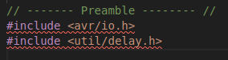

# Chapter 2: Programming AVRs

This chapter is mainly focused on making sure you've got your environment set up correctly.


## Building The Code

Before this point, I never really used Makefiles before so I didn't really know how to use them or what they were used for.

They can be thought of as a shortcut to compiling your code into something your microcontroller will be able to understand. (They also put an end to mistyping commands)

Below is what I enter into my terminal to generate the machine code:

```console
make
```

That should generate some files (blinkLED.elf, blinkLED.map, blinkLED.o, etc.)

Now it's time to flash the Arduino:

```console
make flash_arduinoISP
```

Which, if everything was set up correctly, should leave you with your built in LED, blinking at a frequency of 1 Hz.

If you want to get rid of all of the extra file, there's a handy section for that too!

```console
make squeeky_clean
```

## Issues I Ran Into

While working through this chapter, I ran into a few setup issues: figuring out the correct baud rate, choosing the right programmer, and getting rid of the annoying red error squiggles (still working on this last one).



You can find the solutions I landed on by checking out the Makefiles in each project. But for convenience, I've also outlined them below.

---

### Timing (Clock Speed)

I've played around with this Arudino enough to know this information, but it's worth mentioning in case you hit a wall.

The book assumes you're using a microcontroller on a breadboard without an external oscillator, which means a different default clock speed than the one I used. I'm using a microcontroller running at 16 MHz, so I set this at the top of my Makefile:

```Makefile
F_CPU = 16000000UL
```

### Correct Programmer

The book uses an ATmega168p on a breadboard, which is a cool setup, but I didn't have one on hand and I didn't want to buy any extra hardware.

Instead, I'm using an Arduino Uno R3 SMD that I alread had on hand.

The book assumes a dedicated flash programmer is being used to upload the code to the chip. But since the Uno has a built-in ATmega8u2 acting as a USB-to-serial bridge, uploading code is much simpler.

To use this setup, I set the `PROGRAMMER_TYPE` to:

```Makefile
flash_arduinoISP: PROGRAMMER_TYPE = arduino
```

### Correct Baud Rate

After some testing (mainly guessing) I found the baud rate that worked for me, which ended up being `115200` baud.

If you're checking the Makefile and wonderign where this is set, it's in the `flash_arduinoISP` section, inside the `PROGRAMMER_ARGS`.

```Makefile
flash_arduinoISP: PROGRAMMER_ARGS = -b 115200 -P /dev/ttyACM0 
```

Could I have defined it at the top of the Makefile instead?
**Yes.**
