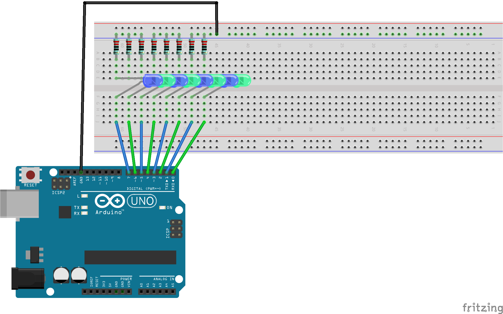

# Chapter 4: Bit Twiddling

This chapter is focused on manipulating individual bits within the GPIO registers without effecting the rest of the byte.

Images COMING SOON

## Materials Used

**Note:** The same materials as chapter 3

* Arduino Uno R3
* (8) LEDs (the color is not important)
* (8) Resistors (at least 220, but anything greater is okay)
* Breadboard
* Jumper wires

## FRITZING Diagram

Here's the fritzing diagram I used for this chapter. It's difficult to see, but I populated every other space on the breadboard with the LEDs and resistors used in this chapter.



## Building The Code

Before this point, I never really used Makefiles before so I didn't really know how to use them or what they were used for.

They can be thought of as a shortcut to compiling your code into something your microcontroller will be able to understand. (They also put an end to mistyping commands)

Below is what I enter into my terminal to generate the machine code:

```console
make
```

That should generate some files (blinkLED.elf, blinkLED.map, blinkLED.o, etc.)

Now it's time to flash the Arduino:

```console
make flash_arduinoISP
```

Which, if everything was set up correctly, should leave you with your built in LED, blinking at a frequency of 1 Hz.

If you want to get rid of all of the extra file, there's a handy section for that too!

```console
make squeeky_clean
```

### Changes From the Original Code

#### Changed Which Port Was Used

The book utilizes `PORTB` as the main registers to connect the LEDs to, but the Arduino Uno R3 SMD doesn't have all 8 pins associated with `PORTB` available. Forunatly, `PORTD` is fully wired to headers pins `D0-D7` so I used those for this chapter.
