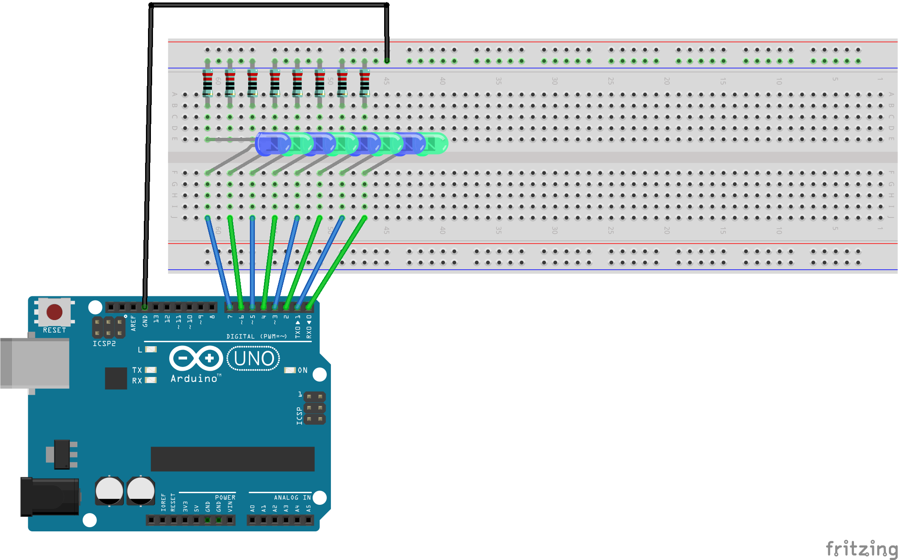

# Chapter 4: Serial I/O

This chapter is focused on how we can get the the Arduino Uno and your desktop/laptop to commincate with eachother using the U(S)ART controller.

The `serialLoopback.c` was a little odd regarding it's operation if you're used to using the built in Arduino serial monitor due to the fact that the letters typed are instantly trasmitted to the Arduino and then printed on the screen. Whereas when using the Arduino serial monitor you world normally type out your message and hit "send".

Make sure when building the circuit to not use dead LED's, this makes it very difficult to display you're ASCII text.

While using port D up to this point has been a good alternative to port B, this had the unintended consequence of using two of the USART GPIO pins, D0 and D1, which are Rx and Tx respectively. This means that during this chapter those pins are high the entire time. I could try doing some bit masking to send the first two bits to a different port to get the same effect.

Images COMING SOON

## Materials Used

**Note:** The same materials as chapter 3

* Arduino Uno R3
* (8) LEDs (the color is not important)
* (8) Resistors (at least 220, but anything greater is okay)
* Breadboard
* Jumper wires

## FRITZING Diagram

Here's the fritzing diagram I used for this chapter. It's difficult to see, but I populated every other space on the breadboard with the LEDs and resistors used in this chapter.



## Building The Code

Before this point, I never really used Makefiles before so I didn't really know how to use them or what they were used for.

They can be thought of as a shortcut to compiling your code into something your microcontroller will be able to understand. (They also put an end to mistyping commands)

Below is what I enter into my terminal to generate the machine code:

```console
make
```

That should generate some files (blinkLED.elf, blinkLED.map, blinkLED.o, etc.)

Now it's time to flash the Arduino:

```console
make flash_arduinoISP
```

Which, if everything was set up correctly, should leave you with your built in LED, blinking at a frequency of 1 Hz.

If you want to get rid of all of the extra file, there's a handy section for that too!

```console
make squeeky_clean
```

### Changes From the Original Code

#### Removed use of `pinDefines.h`

I've removed the inclusion of the `pinDefines.h` library as it seemed to be causing issues when attempting to control LEDs/GPIO.

#### Changed Which Port Was Used

The book utilizes `PORTB` as the main registers to connect the LEDs to, but the Arduino Uno R3 SMD doesn't have all 8 pins associated with `PORTB` available. Fortunately, `PORTD` is fully wired to headers pins `D0-D7` so I used those for this chapter.
